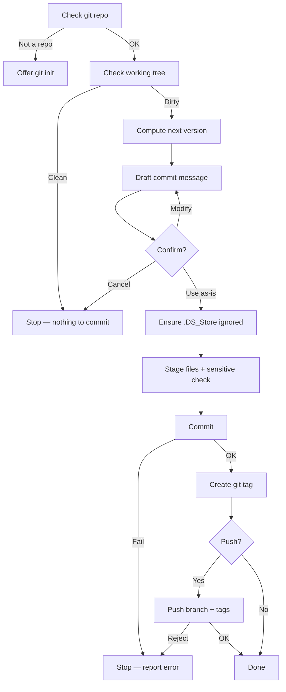

# Project Version Workflow (PVW)

A Claude Code plugin that automates dated version tagging, professional conventional commits, and git tag management through a deterministic, step-by-step workflow.

## Installation

### As a Plugin (Recommended)

```bash
/plugin marketplace add ATreep/project-version-workflow
/plugin install project-version-workflow
```

Invoke with the plugin namespace:

```
/project-version-workflow:update-commit
/project-version-workflow:update-commit-bypass
/project-version-workflow:view-update-log
```

### As a Standalone Skill

Copy the `skills` directory into your Claude Code skills folder:

```bash
cp -r skills/* ~/.claude/skills/
```

Then use the short-form commands:

```
/update-commit
/update-commit-bypass
/view-update-log
```

## Skills

### `/update-commit`

Interactive workflow that generates a dated version, drafts a professional commit message, creates an annotated git tag, and optionally pushes.

**Commit message format:**

```
v260503 feat. add macOS .DS_Store gitignore check

1. Add .DS_Store detection on macOS in Step 3
2. Create .gitignore automatically when missing
3. Stage .gitignore before committing
```

The subject line uses a conventional commit type (`feat.` / `fix.` / `docs.` / `refactor.` / `perf.` / `chore.` / `style.`), and the body lists each meaningful change as a numbered item.

**Workflow:**

```text
0. Preflight        Verify git repo, check working tree state
1. Version          Capture current date+time, form vYYMMDD-HHmmss (e.g., v260601-145633)
2. Draft message    Classify change type, draft subject + body, confirm with user
3. .DS_Store        Auto-ignore on macOS if not already ignored
4. Commit           Stage files explicitly, sensitive-file check, commit
5. Git tag          Create annotated tag matching the version
6. Push             Ask user whether to push branch + tags to remote
```



**Version numbering:**

- Each version uses the format `vYYMMDD-HHmmss` (e.g., `v260601-145633`).
- The suffix is a timestamp (HHmmss = hour, minute, second), not a sequential counter.
- Each invocation produces a unique version thanks to the timestamp.
- The date prefix resets each calendar day at midnight.

### `/update-commit-bypass`

Non-interactive variant of `/update-commit`. Resolves every confirmation prompt to its default. Never asks the user anything.

| Decision point | `/update-commit` | `/update-commit-bypass` |
|---|---|---|
| Not a git repo | Ask | Auto `git init` |
| Commit message | Confirm with user | Use draft as-is |
| Sensitive files | Ask | Auto-unstage + warn |
| Git tag | Create (same) | Create (same) |
| Push | Ask | Auto-push with tags |

Suitable for CI pipelines, automation loops, or hands-off workflows.

### `/view-update-log`

Read-only viewer for the project's update history, sourced from git commit messages.

| Invocation | Output |
|---|---|
| `/view-update-log` | Latest commit + hint about history |
| `/view-update-log history` | Last 10 commits |
| `/view-update-log history N` | Last N commits |
| `/view-update-log v260502` | Full details of a specific version |
| `/view-update-log today` | All commits from today |
| `/view-update-log week` | All commits from the past 7 days |

## Design Decisions

**Explicit staging.** Files are staged by name, never with `git add .` or `git add -A`. This prevents accidental inclusion of untracked or sensitive files.

**No force operations.** The workflow never uses `--force`, `--no-verify`, or `--no-gpg-sign`. If a push is rejected, the error is reported and execution stops.

**Deterministic versioning.** Version tags are computed from the current date and existing commit history. The algorithm is fully specified in the skill document — there is no ambiguity in version selection.

**Annotated git tags.** Every version is recorded as an annotated tag (`git tag -a`), not a lightweight tag. This preserves the version message in the repository's tag metadata.
