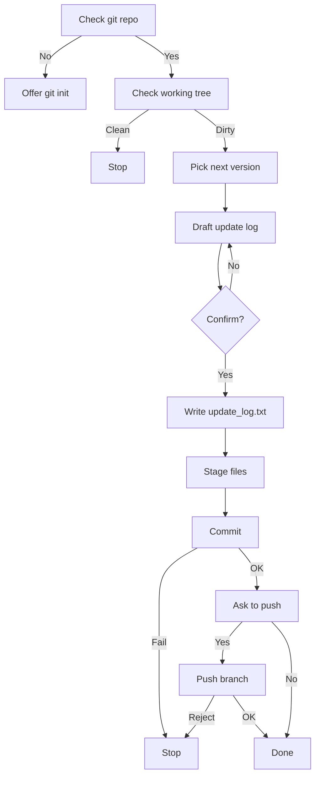

# Project Version Workflow (PVW)

Manage project's versions and iterations by a standard workflow on Claude Code.

## Installation

Copy `skills` folder to your `.claude` directory.

## What PVW Does

The following skills/commands are provided:

1. `/update-commit`: generates a version name, commits a new version and manages update log automatically.

`/update-commit` generates a daily version tag (e.g. `v260416`), records the changes in `update_log.txt` along with the git username when available, commits them, and optionally pushes to remote. It checks for a clean repo, asks you to confirm the change summary, warns about sensitive files, and never force-pushes.

