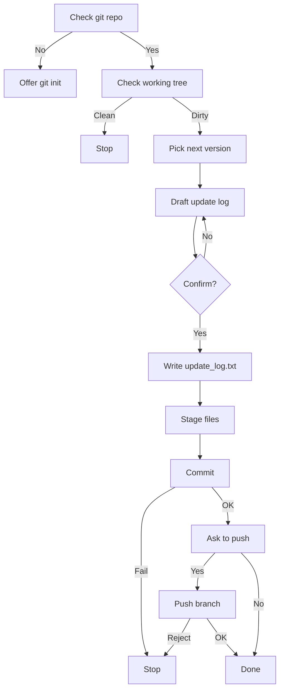

# Project Version Workflow (PVW)

Manage project's versions and iterations by a standard workflow on Claude Code.

## Installation

### As a Plugin (Recommended)

Install via Claude Code's plugin system:

```bash
/plugin install project-version-workflow@github.com/ATreep/project-version-workflow
```

Or add as a marketplace:

```bash
/plugin marketplace add ATreep/project-version-workflow
/plugin install project-version-workflow
```

After installation, invoke the skill with the plugin namespace:

```
/project-version-workflow:update-commit
```


### As a Standalone Skill 

Copy the `skills` folder to your `.claude` directory:

```bash
cp -r skills/* ~/.claude/skills/
```

Then use the short-form command:

```
/update-commit
```


## What PVW Does

The following skill is provided:

- `/update-commit`


Generates a version name, commits a new version and manages update log automatically.

`/update-commit` generates a daily version tag (e.g. `v260416`), records the changes in `update_log.txt` along with the git username when available, commits them, and optionally pushes to remote. It checks for a clean repo, asks you to confirm the change summary, warns about sensitive files, and never force-pushes.


